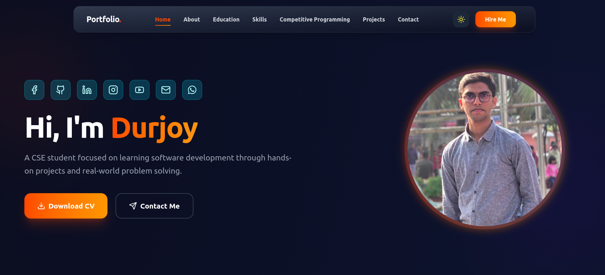

  <h1>Hey there! 👋 I'm Durjoy Chakraborty</h1>

---

<b>Explore my work, projects, and development journey.</b>

 

  

 

---

## 🔥 Featured Projects

<table>
<tr>

<td width="33%" valign="top">

### 🌦️ Weather Forecast App  
Real-time weather search + responsive UI  

  

</td>

<td width="33%" valign="top">

### ✅ Modern To-Do List  
Dark mode + localStorage  

  

</td>

<td width="33%" valign="top">

### 📅 Dynamic Calendar  
Interactive navigation UI  

  

</td>

</tr>

<tr>

<td width="33%" valign="top">

### ⚡ Arduino Projects  
Sensor systems + LCD display  

  

</td>

<td width="33%" valign="top">

### 🚗 Car Rental Website  
Responsive booking UI  

  

</td>

<td width="33%" valign="top">

### ✨ Next Project  
Something exciting coming soon...

</td>

</tr>

</table>

---

## 🛠️ Skills & Tools

  

---

Made with ❤️ in Chattogram, Bangladesh
